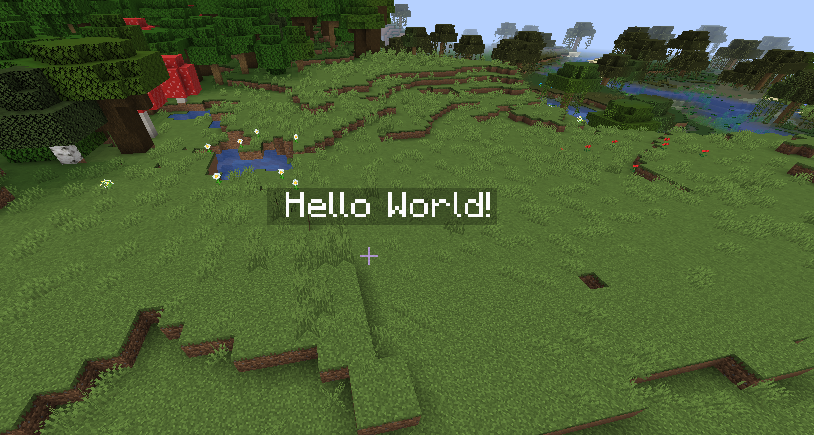

# Hologram API

Very minimal API for creating text hovering in the world:



Currently, only 1.16 is supported and only single-line texts can be created.

There's also no permission system (yet), so any user can create holograms.

A hologram can be created by:
 - Using the provided command `/holo-create Hello world!`
 - Through the public API:
 ```
HologramAPI api = (HologramAPI) Bukkit.getPluginManager().getPlugin("HologramAPI");
api.createHologram(position, "Hello world!");
 ```
